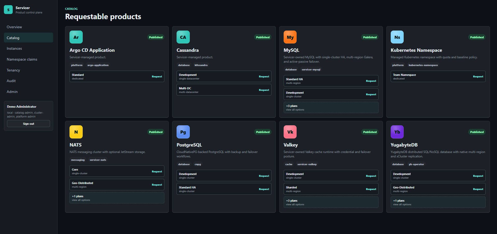

# Servicer

Kubernetes-native control plane for self-service managed services. Servicer gives platform teams a product-shaped API and UI for curated services, while keeping Kubernetes CRDs as the source of truth.



## What it does

Servicer publishes managed service products such as PostgreSQL, MySQL, Valkey, NATS, YugabyteDB, Kubernetes namespaces, and first-pass VM/KubeVirt and Cassandra/K8ssandra offerings. Users request products through the Vue UI or BFF API, and Servicer reconciles them onto one or more target clusters through operator-backed adapters and Git/Argo delivery.

High-level flow:

```text
User -> Vue UI -> BFF -> Servicer CRDs -> Controllers/Adapters -> Target clusters
```

## Repo layout

| Path | Purpose |
|------|---------|
| `api/v1alpha1/` | CRD and API types |
| `cmd/manager/` | Main controller manager binary |
| `cmd/bff/` | Product-facing backend-for-frontend |
| `internal/controllers/` | Reconciliation logic, package installation, projection |
| `internal/adapters/` | Product adapters and runtime contracts |
| `internal/deliveryrepo/` | Git publication for delivery artifacts |
| `config/crd/` | Generated CRDs |
| `config/deploy/` | Demo/local-validation manifests for Kind |
| `deploy/` | Production install manifests |
| `config/samples/` | Demo catalog, packages, tenancy, and targets |
| `web/` | Vue 3 + TypeScript frontend |
| `hack/` | Demo bootstrap and operator/dev scripts |

## Current platform surface

### CRDs

- `Tenant`
- `Project`
- `ClusterTarget`
- `ServiceClass`
- `ServicePlan`
- `ServiceInstance`
- `NamespaceClaim`
- `ServiceBinding`
- `VirtualMachineClaim`
- `ActionRequest`
- `OperatorPackage`
- `Policy`

API group: `platform.servicer.io/v1alpha1`

### Main BFF routes

- `GET /api/auth/config`, `GET /api/auth/session`, `GET|POST /api/auth/login`, `GET /api/auth/callback`, `GET /api/auth/logout`
- `GET /api/overview`
- `GET /api/tenants`
- `GET /api/projects`
- `GET /api/catalog`
- `POST /api/requests`
- `GET /api/instances`
- `GET /api/instances/{name}`
- `PUT /api/instances/{name}`
- `DELETE /api/instances/{name}`
- `POST /api/instances/{name}/actions`
- `POST /api/actions/{name}/approval`
- `GET /api/namespaceclaims`
- `POST /api/namespaceclaims`
- `GET|PUT|DELETE /api/namespaceclaims/{name}`
- `GET /api/servicebindings`
- `GET /api/virtualmachineclaims`
- `GET /api/audit`
- `GET|POST|PUT|DELETE /api/admin/...`

### Product status

| Product | Status |
|---------|--------|
| Kubernetes Namespace | Available |
| PostgreSQL (CloudNativePG) | Available |
| MySQL | Available |
| Valkey | Available |
| NATS | Available |
| YugabyteDB | Available |
| Cassandra (K8ssandra) | Partial |
| Virtual Machine (KubeVirt) | Partial |

See [docs/feature-gaps.md](docs/feature-gaps.md) for the remaining partial areas.

## Deploying to Kubernetes

Tagged builds publish five images to GitHub Container Registry:

- `ghcr.io/sindef/servicer-manager:<version>`
- `ghcr.io/sindef/servicer-syncer:<version>`
- `ghcr.io/sindef/servicer-bff:<version>`
- `ghcr.io/sindef/servicer-web:<version>`
- `ghcr.io/sindef/servicer-tools:<version>`

The `syncer` image is used in local demo and validation paths; production `deploy/`
manifests do not deploy a syncer sidecar.

Each Git tag matching `v*` also publishes a rendered install manifest as a GitHub release asset:

```text
servicer-install-<version>.yaml
```

### Quick install from a tagged release

```bash
kubectl apply -f https://github.com/sindef/servicer/releases/download/<version>/servicer-install-<version>.yaml
```

Example:

```bash
kubectl apply -f https://github.com/sindef/servicer/releases/download/v0.1.0/servicer-install-v0.1.0.yaml
```

### Install from this repo for a specific version

```bash
./hack/render-deploy-manifest.sh v0.1.0 > servicer-install.yaml
kubectl apply -f servicer-install.yaml
```

Or:

```bash
./hack/deploy.sh v0.1.0
```

Optional environment overrides:

- `IMAGE_PREFIX=ghcr.io/<owner>/servicer` for a fork or mirrored registry
- `NAMESPACE=<namespace>` to render into a different namespace

### Base install behavior

`deploy/` is the real-cluster install path. It deploys:

- `manager`
- `bff`
- `web`
- backup and restore jobs using `tools`
- webhook bootstrap/service manifests and RBAC

The web service is a `ClusterIP`. Expose it with port-forward or your own ingress:

```bash
kubectl -n servicer-system port-forward svc/web 8080:80
```

Then open:

```text
http://localhost:8080
```

## Demo environment

`hack/demo-setup.sh` is the primary demo/bootstrap path and is intended to be representative of the real platform shape, not a one-off toy environment.

It creates two Kind clusters:

- `servicer-app`: runs the Servicer control plane
- `servicer-target`: acts as the managed target cluster

The app cluster runs:

- `manager`
- `syncer`
- `bff`
- `web`

The target cluster receives operator packages and materialized runtime resources.

### Prerequisites

- Docker
- `kind`
- `kubectl`

### Bring the demo up

```bash
./hack/demo-setup.sh
```

Then open:

```text
http://localhost:5173
```

Sample login for the seeded demo auth objects:

```text
username: demo-admin
password: demo-admin
provider: Local
```

### Tear the demo down

```bash
./hack/demo-setup.sh down
```

## Local build and verification

### Go test gates

```bash
go test -race -coverprofile=coverage.out ./...
go test ./api/v1alpha1 -run 'Webhook|Validate'
go test ./internal/controllers -run 'Reconciler|Controller'
```

### Frontend PR gates

```bash
cd web
npm ci
npm run lint
npm run test:unit
npm run build
npm run build:budget
npm run test:a11y
```

### Frontend dependency audit

Run from the repo root:

```bash
./hack/npm-audit-web.sh
```

Or directly inside `web/`:

```bash
cd web
npm audit --omit=dev --audit-level=high
```

### Manifest validation

```bash
kubectl kustomize config/deploy > /dev/null
kubectl kustomize deploy > /dev/null
kubectl kustomize config/samples > /dev/null
./hack/manifest-policy.sh deploy
./hack/networkpolicy-smoke.sh
```

### Container builds

```bash
docker build -f Containerfile.manager -t servicer/manager:dev .
docker build -f Containerfile.syncer -t servicer/syncer:dev .
docker build -f Containerfile.bff -t servicer/bff:dev .
docker build -f Containerfile.web -t servicer/web:dev .
docker build -f Containerfile.tools -t servicer/tools:dev .
```

### Local CI-style image security checks

Run the same build + Trivy image scan flow used by CI before pushing:

```bash
./hack/ci-local-build-security.sh
```

This also runs `./hack/helm-cli-smoke.sh` to verify Helm CLI compatibility
with the manager's pinned Helm version.

Fast path when you only want image build/scan (skip validate checks):

```bash
./hack/ci-local-build-security.sh --skip-validate
```

### Render versioned install manifests

```bash
./hack/render-deploy-manifest.sh v0.1.0 > /dev/null
```

## Delivery model

Servicer can publish rendered artifacts into a Git worktree/repository and create Argo CD `Application` or `ApplicationSet` resources to drive sync onto target clusters. The control plane remains CRD-first: Git publication and Argo are delivery mechanisms, not the authoring system of record.

Relevant manager flags include:

- `--delivery-repo-url`
- `--delivery-repo-path`
- `--delivery-repo-worktree`
- `--delivery-repo-auto-commit`
- `--argocd-namespace`
- `--argocd-project`

Production installs use GitOps repository delivery by default. See [Production install](docs/production-install.md) for required Secrets, ingress/TLS, network policy, and RBAC details.

## Authentication

The BFF supports:

- local username/password authentication backed by Servicer `User` and `AuthProvider` CRDs
- OIDC browser login with callback flow
- LDAP username/password authentication with directory search/bind configuration from CRDs
- server-managed encrypted browser session cookies
- refresh-token renewal
- bearer-token API access

Optional bootstrap env vars for first-run access:

- `SERVICER_BOOTSTRAP_ADMIN_USERNAME`
- `SERVICER_BOOTSTRAP_ADMIN_PASSWORD`
- `SERVICER_BOOTSTRAP_ADMIN_EMAIL`
- `SERVICER_SESSION_SECRET`

## Secrets note

This repo does not intentionally store live production credentials. It does include demo/bootstrap defaults in sample manifests where certain upstream operators require initial local-only credentials to self-initialize during demo bring-up.

## Licensing

Servicer is Apache-2.0 licensed. Third-party operators, services, Go modules,
and web packages keep their own licenses and notices. See
[Third-party notices](THIRD_PARTY_NOTICES.md), and run
`./hack/generate-third-party-licenses.sh` before publishing release artifacts so
the generated `dist/THIRD_PARTY_LICENSES/` bundle is shipped beside them.

## Additional docs

- [Feature gap analysis](docs/feature-gaps.md)
- [Release notes: v0.1.0](docs/releases/v0.1.0.md)
- [Changelog](CHANGELOG.md)
- [Catalog lifecycle](docs/catalog-lifecycle.md)
- [Audit](docs/audit.md)
- [API compatibility](docs/api-compatibility.md)
- [Observability](docs/observability.md)
- [Product support matrix](docs/product-support-matrix.md)
- [Production install](docs/production-install.md)
- [Product standards](docs/product-standards.md)
- [Reverse proxy](docs/reverse-proxy.md)
- [Tenant threat model](docs/tenant-threat-model.md)
- [Repository lifecycle](docs/repository-lifecycle.md)
- [Deletion and retention](docs/deletion-retention.md)
- [Scale limits](docs/scale-limits.md)
- [Product runbooks](docs/product-runbooks.md)
- [Supply chain](docs/supply-chain.md)
